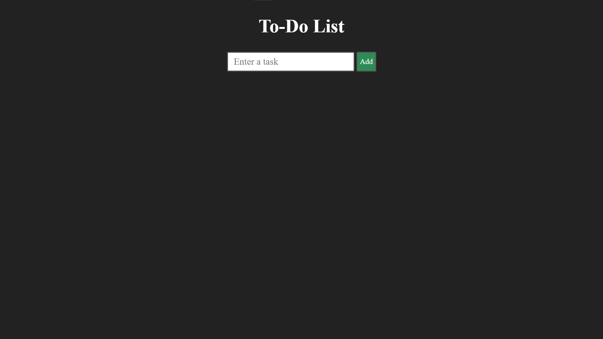
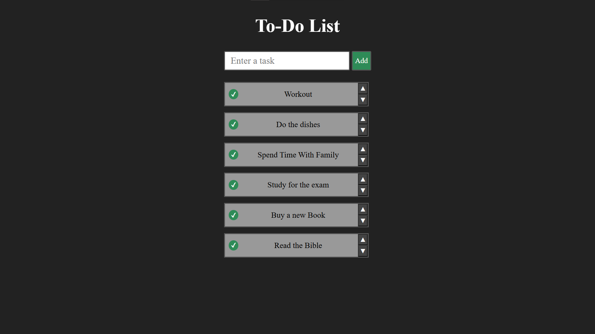

# 📋 To-Do List

  
  

Lista de tarefas para resolver os problemas do dia-a-dia sem estressar a cabeça.

---
## **🕹️ Demonstração**
👉🏻 [Clique Aqui](https://italoalulas.github.io/to-do-list/)

---
## ⚙️ **Funcionalidades**

- ➕ Botão Adicionar: adiciona uma tarefa preenchida pelo usuário à lista de tarefas.
- ✅ Botão Concluir: conclui uma tarefa, eliminando-a da lista de tarefas.
- ↕️ Botões Subir/Descer: move uma tarefa para cima ou para baixo na lista de tarefas.
- 🖥️🔁📱 Responsivo para desktops, tablets e celulares.

---
## 🧠 **Aprendizados**

- Manipulação de Arrays utilizando o hook useState().
- Manipulação de evento com onChange.
- Barra de scroll e responsividade para items gerados dinamicamente.
